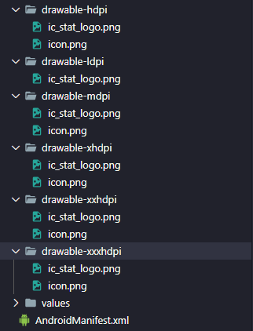

# Implementar notificação push com Firebase no React Native ❤

 Neste tutorial, você aprenderá como implementar notificações por push como um recurso de aplicativo usando o React Native e o Firebase.

### Existem duas maneiras principais de enviar notificações por push aos usuários do aplicativo: local e remoto. 

### - Local
- As notificações locais são enviadas de um aplicativo React Native

### - Remoto
- As notificações push remotas são enviadas do servidor ou de um serviço de notificação push, como o Firebase Cloud Messaging Service (FCM).


## Pré-requisitos

Vamos usar o [react-native-firebase](https://github.com/invertase/react-native-firebase)  para implementar notificações push no React-native.

Primeiro, crie um projeto no seu console do [Google Firebase](https://console.firebase.google.com/)

## Criando Projeto

Crie seu projeto React Native e insira seu diretório

``` js
  $ react-native init RNPushNotification
  $ cd RNPushNotification
```

Adicione e vincule o pacote React Native Firebase ao seu aplicativo

``` js
  $ npm install react-native-firebase
  $ react-native link react-native-firebase
```

## Adicionando Firebase ao seu aplicativo

Registre seu aplicativo no Firebase e siga as etapas de [configuração](https://firebase.google.com/docs/cloud-messaging/android/client?hl=pt-br) do Android.

Faça o download do seu google-services.json. Não se esqueça de colocá-los na pasta correta.


# Configurando projeto Android

#### Vá no arquivo `MainApplication.java` e coloque as seguintes linhas:

``` js
....
....
 // Adicione estas duas linhas
import  io.invertase.firebase.messaging.RNFirebaseMessagingPackage ;
import  io.invertase.firebase.notifications.RNFirebaseNotificationsPackage ;

public class MainApplication extends Application implements ReactApplication {

  private final ReactNativeHost mReactNativeHost =
      new ReactNativeHost(this) {
        @Override
        protected List<ReactPackage> getPackages() {
          @SuppressWarnings("UnnecessaryLocalVariable")
          List<ReactPackage> packages = new PackageList(this).getPackages();
          // Pacotes que não podem ser vinculados automaticamente ainda podem ser adicionados manualmente aqui, por exemplo:
          // packages.add(new MyReactNativePackage());
          packages.add(new RNFirebaseMessagingPackage()); // Adicione esta linha
          packages.add(new RNFirebaseNotificationsPackage()); // Adicione esta linha 
          return packages;
        }
      };
}

```

#### Vá no arquivo `android/app/build.gradle` e adicione as seguintes linhas:
``` js
dependencies {
    implementation fileTree(dir: "libs", include: ["*.jar"])
    //noinspection GradleDynamicVersion
    implementation "com.facebook.react:react-native:+"  // From node_modules
    
    //adicione estas linhas
    implementation "com.google.firebase:firebase-messaging:20.1.5"
    implementation "com.google.android.gms:play-services-base:17.2.1"
    implementation "com.google.firebase:firebase-core:16.0.8"

     compile(project(':react-native-firebase')) {   
       transitive = false
     }
 }   
 // adicione esta linha ao final da página 
apply plugin: 'com.google.gms.google-services'
```
#### Vá no arquivo `android/app/src/main/AndroidManifest.xml` e adicione as seguintes linhas:

``` js
<manifest …>
  <!-- Adicione estas linhas  -->
  <uses-permission android:name="android.permission.INTERNET" />
  <uses-permission android:name="android.permission.RECEIVE_BOOT_COMPLETED" />
  <uses-permission android:name="android.permission.VIBRATE" />
  
  <application ...>

  <!-- Se quisermos agendar notificações locais, também devemos adicionar o seguinte -->

    <receiver android:name="io.invertase.firebase.notifications.RNFirebaseNotificationReceiver"/>
      <receiver 
        android:enabled="true"
        android:exported="true"
        android:name="io.invertase.firebase.notifications.RNFirebaseNotificationsRebootReceiver">
        <intent-filter>
          <action android:name="android.intent.action.BOOT_COMPLETED"/>
          <action android:name="android.intent.action.QUICKBOOT_POWERON"/>
          <action android:name="com.htc.intent.action.QUICKBOOT_POWERON"/>
          <category android:name="android.intent.category.DEFAULT" />
        </intent-filter>
      </receiver>
      <receiver android:name="io.invertase.firebase.notifications.RNFirebaseBackgroundNotificationActionReceiver" android:exported="true">
      <intent-filter>
        <action android:name="io.invertase.firebase.notifications.BackgroundAction"/>
      </intent-filter>
    </receiver>
    <service android:name="io.invertase.firebase.notifications.RNFirebaseBackgroundNotificationActionsService"/>
    
    <!-- Adicione esta linha ao serviço de mensagens  -->
    <service android:name="io.invertase.firebase.messaging.RNFirebaseMessagingService">
      <intent-filter>
        <action android:name="com.google.firebase.MESSAGING_EVENT" />
      </intent-filter>
    </service>
    
   <!-- Adicione esta linha para ativar os serviços de mensagens backgound -->
   <service android:name="io.invertase.firebase.messaging.RNFirebaseBackgroundMessagingService"/>

  </application>
</manifest>
```
 Depois que tudo estiver instalado e configurado agora, temos que implementar a notificação push do FCM no lado do React Native usando o módulo React Native Firebase.

## Receber notificações push

Agora vamos codificar a parte mais esperada ... Receber notificações! 😉

Antes de integrar o código, instale as seguintes dependências:
``` 
npm install @react-native-community/async-storage
```

### Então, vamos escrever o código abaixo no `App.js` arquivo
``` js
import React, { Component } from "react";
import { Alert, View } from "react-native";
import AsyncStorage from '@react-native-community/async-storage';
import firebase from "react-native-firebase";

class App extends Component {

  async componentDidMount() {
    //verificamos se o usuário concedeu permissão para receber notificações por push.
    this.checkPermission();
    // Registrar todos os ouvintes para notificação
    this.createNotificationListeners();
  }

  async checkPermission() {
    const enabled = await firebase.messaging().hasPermission();
    // Se a Premiação concedida prosseguir para a busca do token
    if (enabled) {
      this.getToken();
    } else {
      // Se a permissão não tiver sido concedida ao nosso aplicativo, solicite o usuário no método requestPermission. 
      this.requestPermission();
    }
  }

  async getToken() {
    let fcmToken = await AsyncStorage.getItem('fcmToken');
    if (!fcmToken) {
      fcmToken = await firebase.messaging().getToken();
      if (fcmToken) {
        // usuário possui um token de dispositivo
        await AsyncStorage.setItem('fcmToken', fcmToken);
      }
    }
  }

  async requestPermission() {
    try {
      await firebase.messaging().requestPermission();
      // O usuário autorizou
      this.getToken();
    } catch (error) {
      // O usuário rejeitou permissões
      console.log('permission rejected');
    }
  }

  async createNotificationListeners() {

    // Esse ouvinte é acionado quando a notificação é recebida em primeiro plano
    this.notificationListener = firebase.notifications().onNotification((notification) => {
      const { title, body } = notification;
      this.displayNotification(title, body);
    });

    // Esse ouvinte é acionado quando o aplicativo está em segundo plano e clicamos, tocamos e abrimos a notificação
    this.notificationOpenedListener = firebase.notifications().onNotificationOpened((notificationOpen) => {
      const { title, body } = notificationOpen.notification;
      this.displayNotification(title, body);
    });

    // Este ouvinte é acionado quando o aplicativo é fechado e clicamos, tocamos e abrimos a notificação
    const notificationOpen = await firebase.notifications().getInitialNotification();
    if (notificationOpen) {
      const { title, body } = notificationOpen.notification;
      this.displayNotification(title, body);
    }
  }


  displayNotification(title, body) {
    // exibimos uma notificação na caixa de alerta com título e corpo
    Alert.alert(
      title, body,
      [
        { text: 'Ok', onPress: () => console.log('ok pressed') },
      ],
      { cancelable: false },
    );
  }

  render() {
    return (
      <View style={{ flex: 1 }}>
        <Text>React Native Push Notification</Text>
      </View>
    );
  }
}

export default App;
```

### Notificações de escuta

 Agora estamos prontos para ouvir os eventos de notificação por push. Antes de prosseguir, você deve conhecer os diferentes tipos de notificações suportadas pelo Firebase.
 - Mensagens apenas de notificação: são mensagens de exibição que são tratadas automaticamente pelo Firebase SDK. As notificações são lançadas na bandeja do dispositivo.
 
 - Notificação + mensagens de dados opcionais: elas também são tratadas pelo Firebase SDK. A única diferença aqui é quando o usuário toca na notificação, seu aplicativo recebe uma carga útil associada a essa notificação.
 
 - Mensagens apenas de dados: esses tipos de notificações são gerenciados exclusivamente pelo aplicativo. Nenhuma notificação é lançada na bandeja do dispositivo, a menos que o aplicativo faça isso explicitamente.

## Depois de configurar tudo corretamente, podemos testar diretamente no console do firebase:

- Vá para a opção Cloud Messaging no painel esquerdo.
- Clique em Enviar sua primeira mensagem
- Digite o texto de teste, selecione o aplicativo Android para o qual deseja enviar o aplicativo e clique em Enviar.


### Aqui está a nossa notificação, chegou!!!! 👌😃


### Existem alguns pontos que você deve saber

- Quando um aplicativo está em segundo plano e é morto no Android e você deseja ouvir a notificação de dados, portanto, é necessário implementar a funcionalidade [JS sem cabeça](https://github.com/invertase/react-native-firebase-docs/blob/master/docs/messaging/receiving-messages.md#2-handle-background-messages) .

- Android, quando o aplicativo não está em segundo plano ou está morto e você guia na biblioteca do Notification react-native-firebase, não será possível obter o título e o corpo da notificação. Ele aparecerá indefinido, portanto, você também precisará enviar o título e o corpo nos dados da notificação.

### Configuração dos icones no android

#### No android para que seja exibido os icones é necessário que você faça os seguintes passos:


- Acesse o link para fazer o download dos icones em seus tamanhos específicos [Icon Notification](https://romannurik.github.io/AndroidAssetStudio/icons-notification#source.type=clipart&source.clipart=ac_unit&source.space.trim=1&source.space.pad=0&name=ic_stat_ac_unit)

 - Após ter feito o download dos icones, coloque eles dentro da pasta `android/app/src/main/res`


- Proximo passo é você ir no `AndroidManifest.xml` e adicionar as seguintes linhas:
``` js
 <manifest ...

    <application ...
    
    //Adicione estas linhas
     <meta-data
      android:name="com.google.firebase.messaging.default_notification_icon"
      android:resource="@drawable/ic_stat_logo" />
```

### E pronto seus icones estarão funcionando perfeitamente
 

 
